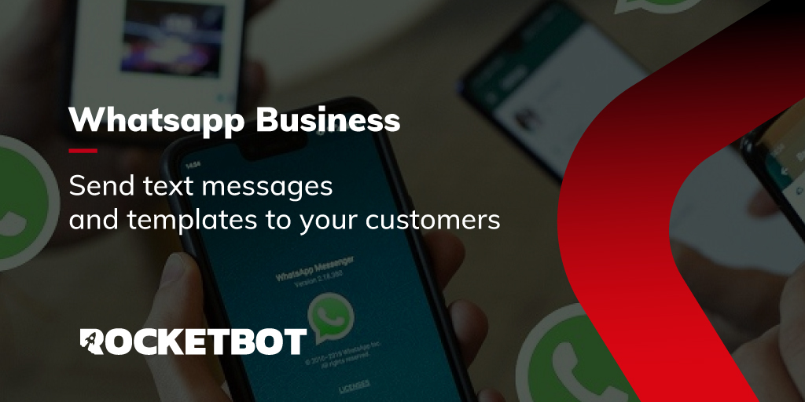

# Whatsapp Business
  
Módulo para conectarse con la api de Whatsapp Business y enviar mensajes de texto o de plantilla  

*Read this in other languages: [English](Manual_WhatsappBusiness.md), [Español](Manual_WhatsappBusiness.es.md), [Português](Manual_WhatsappBusiness.pr.md)*

  

## Como instalar este módulo
  
La instalación puede ser:
1. Manual: __Descargar__ el archivo .zip y descomprimirlo en la carpeta modules. El nombre de la carpeta debe ser el mismo al del módulo y dentro debe tener los siguientes archivos y carpetas: \__init__.py, package.json, docs, example y libs. Si tiene abierta la aplicación, refresca el navegador para poder utilizar el nuevo modulo.
2. Automática: Al ingresar a Rocketbot Studio sobre el margen derecho encontrara la sección de **Addons**, seleccionar **Install Mods**, buscar el modulo deseado y presionar install.      

## Como usar este módulo
Para utilizar este módulo, se debe realizar la siguiente configuración:
1. __Inicia sesión__ o __regístrate__ en https://developers.facebook.com/
2. Ve a tus Apps en https://developers.facebook.com/apps/
3. Crea una nueva App. Debe ser de tipo Negocio. En la página siguiente, elije el nombre, el correo del administrador y la Cuenta comercial a la que se vinculará la App.
4. Al crear la App, se te redirigirá a la página de la misma, la cual se encontrará en modo Desarrollo. En esta página, selecciona en la app Whatsapp el botón __Configurar__ y luego __Configuración de la API__. Al hacer click en Continuar, se te otorgará un número de prueba para enviar mensajes y hasta 5 contactos que puedes agregar para recibir los mensajes de prueba.
5. En la página de Inicio rápido, haz click en __Empezar a usar la API__. 
6. Tanto en la App en desarrollo como en producción, sólo puedes enviar mensajes que incluyen texto a conversaciones que hayan sido iniciadas por el usuario. Si la conversación es iniciada por la empresa, deberás enviar plantillas que hayan sido aprobadas por META. Para más información revisa el siguiente link: https://developers.facebook.com/docs/whatsapp/api/messages/message-templates
7. En la página de Primeros pasos, verás un token de acceso temporal para usar la API. Este token tiene una duración de 24 horas. Si quieres usar la API por más tiempo, debes solicitar un token de acceso permanente (Ver punto 12).
8. En esta sección tendrás acceso al número de prueba de Whatsapp y a la configuración de los números de destinatario. También tienes el Identificador de número de teléfono. Tanto este dato como el token serán necesarios para poder conectarte a través del módulo en modo desarrollador.
9. Prueba asociar un destinatario y enviar desde el módulo la plantilla por defecto hello_world con el lenguaje en_US. Si todo funciona correctamente, recibirás un mensaje de Whatsapp con el texto "Hello World!".
10. Una vez comprobado el funcionamiento, puedes crear tus propias plantillas que necesitan ser aprobadas por META y enviarlas a través del módulo. Para más información sobre las plantillas, revisa el siguiente link: https://developers.facebook.com/docs/whatsapp/api/messages/message-templates
11. Una vez que hayas comprobado el funcionamiento de la API, deberás agregar un número de teléfono de tu empresa para poder enviar mensajes a tus clientes. Haz click en el botón del paso 5 __Agregar número de teléfono__ y sigue los pasos para crear el perfil de Whatsapp Business. Una vez agregado, guarda el Identificador de número de teléfono, este dato será necesario para poder conectarte a través del módulo.
12. Al tener un número de teléfono agregado, queda configurar la aplicación para pasar al modo productivo y generar un token de acceso permanente. Para esto, debes ir a la página de la App en https://developers.facebook.com/apps/ y seleccionar la App que creaste. En la página de la App, selecciona en la app Whatsapp el botón "Configurar" y luego "Configuración básica".
13. Allí deberás otorgar una __URL de la Política de privacidad__ de forma obligatoria y el resto de campos de forma opcional. Al finalizar haz click en __Guardar cambios__.
14. Con todo ya configurado, la app está lista para pasar al modo Activo. Para ello ve hacia arriba de todo en la web y mueve el selector de Desarrollo a Activo. 
15. Obtener token permanente: Para ello debes tener una cuenta comercial de Meta. Ingresa a https://business.facebook.com/ y en el menú de la izquierda selecciona tu empresa, y haz click en la rueda de configuración, luego en Configuración de negocio. En la nueva ventana haz click en Usuarios del sistema y agrega uno nuevo.
16. Acepta el mensaje de la ventana que se abre y luego selecciona un nombre para tu nuevo usuario. En Rol debes colocar Administrador.
17. Al crear el usuario haz click en el botón __Agregar activos__. En la ventana que se abrirá selecciona Apps, luego marca la App que creaste y activa la opción __Administrar App__, luego Guarda los cambios.
18. Al asignar el activo, haz click en __Generar nuevo token__. Selecciona tu App y marca todos los permisos de la lista (No son todos necesarios pero si en un futuro se agregan más integraciones en Rocketbot podrás utilizar la misma credencial). Haz click en __Generar token__. Este será el token permanente que podrás utilizar para autenticarte en el módulo.

## Descripción de los comandos

### Configurar servidor
  
Configura la API de Whatsapp para poder ejecutar comandos
|Parámetros|Descripción|ejemplo|
| --- | --- | --- |
|API KEY|API KEY obtenida en https//developers.facebook.com/|api-key|
|Identificador de número de teléfono|Identificador de número de teléfono obtenido en https//developers.facebook.com/|116787907958900|
|Asignar resultado a variable|Variable donde se guardará el resultado|Variable|

### Enviar mensaje de texto o plantilla
  
Envía un mensaje de texto o proveniente de una plantilla a un número de Whatsapp
|Parámetros|Descripción|ejemplo|
| --- | --- | --- |
|Número de Whatsapp|Número de Whatsapp al que se enviará el mensaje|54111222333|
|Plantilla y código de idioma|Plantilla de mensaje y código de idioma que se enviará al número de Whatsapp.|hello_world, es_MX|
|Mensaje|Mensaje que se enviará al número de Whatsapp|Hola, ¿cómo estás?|
|Asignar resultado a variable|Variable donde se guardará el resultado|Variable|
